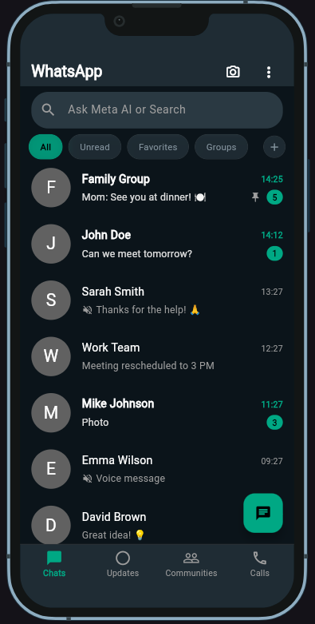
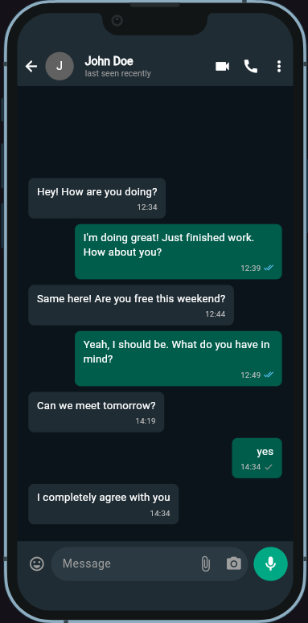
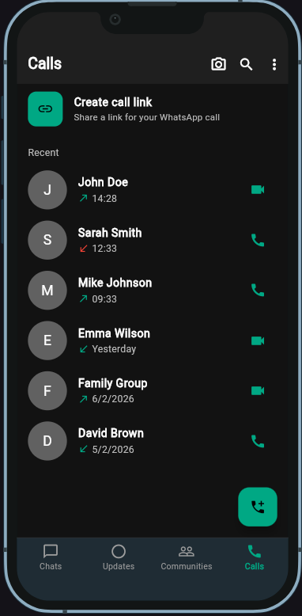
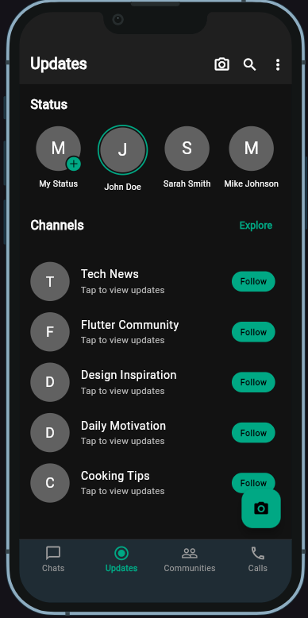
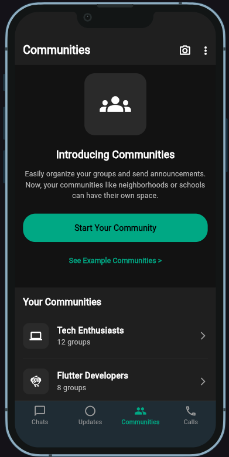
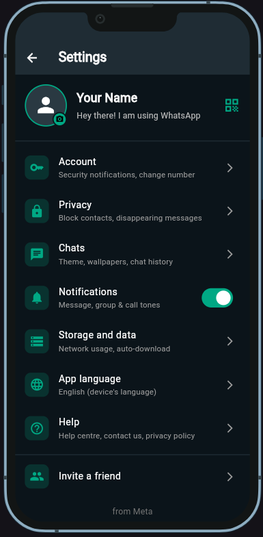
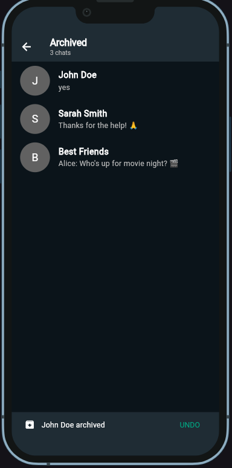

# WhatsApp Clone

A Flutter-based UI clone of WhatsApp Messenger with modern design and smooth animations.

## ✨ Features

- **Chat Interface** - Beautiful messaging UI with real-time message display
- **Contact List** - Display contacts with online/offline status
- **Call Screen** - Voice and video call interface
- **Status Updates** - Share and view status stories
- **Settings Page** - User profile and app settings
- **Smooth Animations** - Fluid transitions and interactive UI elements
- **Material Design** - Modern and responsive design patterns
- **Dark Mode Support** - Beautiful dark theme support

## 📸 Screenshots

### Main Interface

<div style="display: flex; flex-wrap: wrap; gap: 10px;">
  
  
  
</div>

### Additional Features

<div style="display: flex; flex-wrap: wrap; gap: 10px;">
  
  
  
</div>

### User Settings

<div style="display: flex; flex-wrap: wrap; gap: 10px;">
  
  
</div>

## 🚀 Getting Started

### Prerequisites
- Flutter SDK (>=3.0.0)
- Dart SDK (>=3.0.0)
- Android Studio / Xcode (for emulator/device)

### Installation

1. **Clone the repository**
   ```bash
   git clone https://github.com/muhammadwasif12/WhatsApp-Clone.git
   cd WhatsApp-Clone
   ```

2. **Install dependencies**
   ```bash
   flutter pub get
   ```

3. **Run the app**
   ```bash
   flutter run
   ```

## 📁 Project Structure

```
lib/
├── main.dart              # Entry point of the application
├── data/                  # Data models and services
├── models/                # Data model classes
├── providers/             # State management providers
├── views/                 # Screen/page widgets
├── widgets/               # Reusable UI components
└── assets/                # Images and assets
```

## 🛠️ Technologies Used

- **Flutter** - UI Framework
- **Dart** - Programming Language
- **Provider** - State Management (if used)
- **Firebase** - Backend (optional)

## 📱 Supported Platforms

- ✅ Android
- ✅ iOS
- ✅ Web (coming soon)
- ✅ Windows
- ✅ macOS
- ✅ Linux

## 🎨 UI Components

- Message Bubbles
- Contact Cards
- Call Interface
- Status Stories
- Navigation Drawer
- Chat List
- Search Functionality

## 📝 Configuration

Edit `pubspec.yaml` to customize dependencies and app configuration.

## 🤝 Contributing

Contributions are welcome! Please feel free to submit a Pull Request.

## 📄 License

This project is open source and available under the MIT License.

## 👨‍💻 Author

**Muhammad Wasif**
- GitHub: [@muhammadwasif12](https://github.com/muhammadwasif12)

## 🙏 Acknowledgments

- Flutter Team for the amazing framework
- WhatsApp for inspiring the UI design

---

**Note**: This is a UI clone for educational purposes only. This is not an official WhatsApp product.
